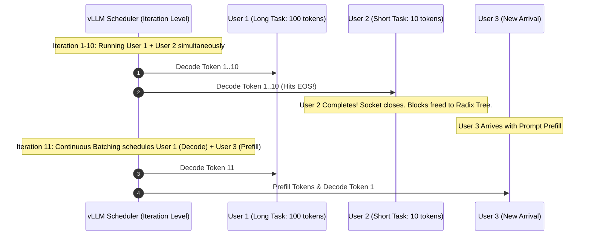
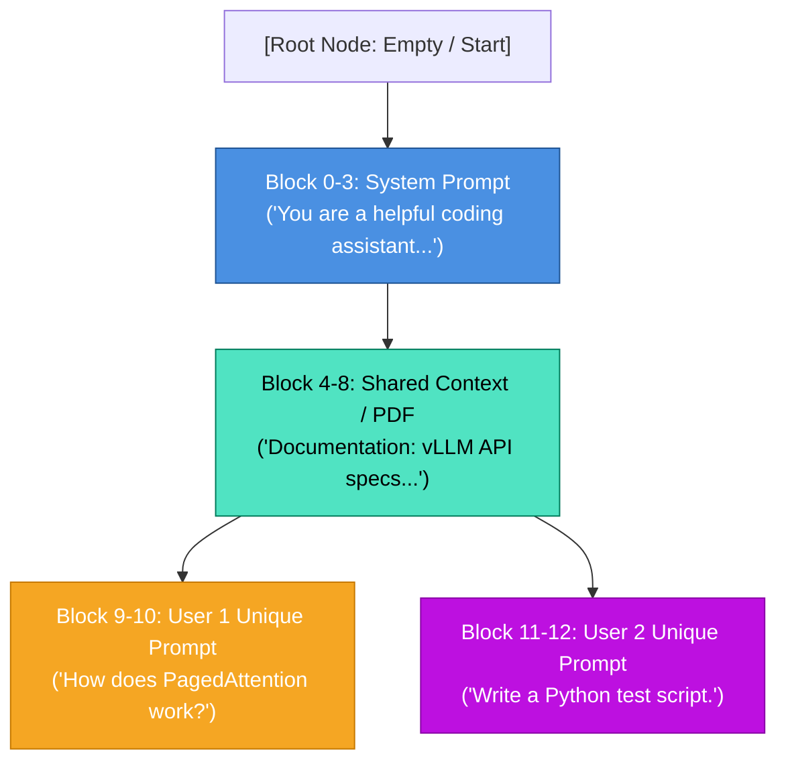
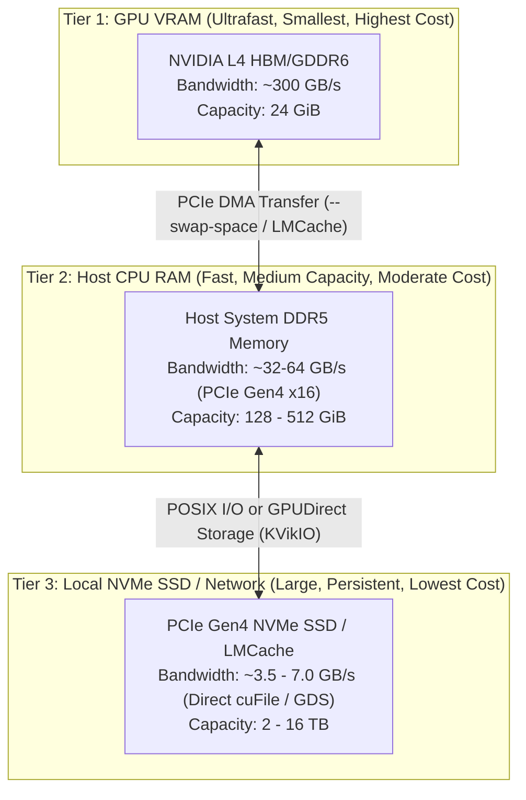

# 🚀 Complete Deep-Dive: vLLM GPU Serving, Continuous Batching, Radix Tree Caching & Architecture

This comprehensive master guide documents everything accomplished, architected, benchmarked, and analyzed today on the **vLLM GPU Deployment** system running on **NVIDIA L4 (24GB VRAM)**.

---

## 📑 Table of Contents
1. [Executive Summary & Hardware Deployment](#1-executive-summary--hardware-deployment)
2. [The Evolution of LLM Batching: Why Continuous Batching Matters](#2-the-evolution-of-llm-batching-why-continuous-batching-matters)
3. [End-to-End System Architecture & Data Flow](#3-end-to-end-system-architecture--data-flow)
4. [PagedAttention & The Radix Tree Prefix Cache](#4-pagedattention--the-radix-tree-prefix-cache)
5. [The User's Questions & Technical Answers (Q&A Masterclass)](#5-the-users-questions--technical-answers-qa-masterclass)
6. [Multi-Tier Memory Hierarchy: Tier 1 vs Tier 2 vs Tier 3](#6-multi-tier-memory-hierarchy-tier-1-vs-tier-2-vs-tier-3)
7. [The Interactive GPU Architecture Simulator](#7-the-interactive-gpu-architecture-simulator)
8. [Codebase & Script Manifest](#8-codebase--script-manifest)
9. [How to Quantize Models: A Complete Practical Guide (AWQ, GPTQ, FP8)](#9-how-to-quantize-models-a-complete-practical-guide-awq-gptq-fp8)

---

## 1. Executive Summary & Hardware Deployment

Today we transitioned from hanging cloud queues to a high-performance, automated serverless GPU deployment on **Modal** utilizing pre-quantized 8-bit weights.

### 📊 Real Hardware Metrics (Measured from Live NVIDIA L4 Container)

| Hardware & Engine Component | Real Value Measured | Architectural Significance |
| :--- | :---: | :--- |
| **GPU Model** | **NVIDIA L4 (Ada Lovelace)** | 24 GiB GDDR6 VRAM, 4th-Gen Tensor Cores with FP8/INT8 support. |
| **Model Deployed** | `Qwen/Qwen2.5-7B-Instruct-GPTQ-Int8` | 7.61B parameters quantized to 8-bit integers via GPTQ. |
| **Model Weight Footprint** | **8.29 GiB** | Loads in **1.45 seconds** using high-speed `MarlinLinearKernel` (vs 14.29 GiB in FP16). |
| **Free VRAM for KV Cache** | **11.03 GiB** | Massive dedicated headroom purely for context memory and multi-user chat sessions. |
| **KV Cache Block Capacity** | **206,480 tokens** | ~12,905 physical blocks (16 tokens/block). |
| **Max 16K Concurrency** | **12.60x** | Can host 12 teammates concurrently at maximum 16,384 context length without swapping. |
| **Attention Backend** | **FlashAttention-2** | Tile-based attention kernel bypassing VRAM roundtrips for QK^T and Softmax. |
| **Prefix Cache Hit Rate** | **37.2% – 74.3%** | Repeated prompts/tools skip prefill entirely; response latency drops to ~1.1s. |
| **Tool Calling Parser** | **Hermes 2 Pro Format** | Zero-latency structured JSON extraction for autonomous agents. |

---

## 2. The Evolution of LLM Batching: Why Continuous Batching Matters

To understand why vLLM is fast, we must look at how batching evolved across three generations.

### Generation 1: Static Batching (Naive Batching)
* **How it worked:** In traditional deep learning, $N$ prompts are grouped together into a rectangular matrix $[B, S]$ where $B$ is batch size and $S$ is maximum sequence length. Shorter sequences are padded with `<pad>` tokens.
* **The Fatal Flaw:** Generation stops only when the **longest request** finishes. If Request 1 finishes in 10 tokens and Request 2 needs 1,000 tokens, Request 1's GPU resources sit completely idle for 990 iterations, wasting compute and memory.

### Generation 2: Dynamic Batching (Request-Level Batching)
* **How it worked:** The server waits for incoming requests over a time window (e.g. 50ms) and forms a batch.
* **The Flaw:** Better than static, but once a batch starts execution on the GPU, new incoming requests cannot join until the entire batch completes. High tail latency ($P_{99}$) for new users.

### Generation 3: Continuous Batching (Iteration-Level Scheduling — vLLM)
* **Paper / Origin:** Introduced by Orca (OSDI 2022) and popularized by vLLM (SGLang / vLLM 2023).
* **How it works:** Batching is performed at the **iteration level** (every single forward token pass, $\approx 25-35\text{ ms}$).
* **Dynamic Join & Leave:**
  * When a user request generates an `[EOS]` (End-of-Sequence) token, it **leaves the batch immediately**. Its KV blocks are released or marked for prefix reuse.
  * An incoming request immediately **joins the batch on the very next token iteration**.
  * **Chunked Prefill:** Long incoming prefill prompts are divided into chunks and batched alongside ongoing single-token decodes, keeping GPU compute utilization near 100% while preventing decode starvation.



---

## 3. End-to-End System Architecture & Data Flow

Here is the **Enlarged Full-Scale Architectural Blueprint** showing every sub-system, buffer, socket, queue, and GPU hardware register from incoming HTTP packet to silicon execution:

```mermaid
flowchart TD
    %% Global Styling
    classDef edgeStyle fill:#1E293B,stroke:#38BDF8,stroke-width:2px,color:#F8FAFC;
    classDef serverStyle fill:#0F172A,stroke:#34D399,stroke-width:2px,color:#F8FAFC;
    classDef vllmCoreStyle fill:#18181B,stroke:#F59E0B,stroke-width:2px,color:#F8FAFC;
    classDef gpuHwStyle fill:#3B0764,stroke:#C084FC,stroke-width:2px,color:#F8FAFC;
    classDef memStyle fill:#064E3B,stroke:#10B981,stroke-width:2px,color:#F8FAFC;

    subgraph INGRESS["1. NETWORK INGRESS & EDGE GATEWAY"]
        ClientA["User 1 / Amp Harness<br/>(Client Session A)"]
        ClientB["User 2 / Teammate<br/>(Client Session B)"]
        EdgeProxy["Modal Global TLS Ingress Proxy<br/>Port 443 (SSL/TLS Termination)"]
        ClientA -->|"HTTPS POST /v1/chat/completions"| EdgeProxy
        ClientB -->|"HTTPS POST /v1/chat/completions"| EdgeProxy
    end

    subgraph API_SERVER["2. HTTP RUNTIME & PARSER LAYER (FastAPI / Uvicorn Port 8000)"]
        FastAPIEndpoint["FastAPI Async Request Handler"]
        EdgeProxy -->|"Internal Loopback TCP (Port 8000)"| FastAPIEndpoint
        
        subgraph PROTOCOL_PIPELINE["Protocol & Tool Pipeline"]
            HFTokenizer["HuggingFace Tokenizer<br/>(Raw Text -> Token IDs Vector)"]
            HermesParser["Hermes 2 Pro Tool Call Parser<br/>(Extracts function arguments & JSON schema)"]
            ChatTemplate["ChatML Template Formatter<br/>(&lt;|im_start|&gt;system / user / assistant)"]
        end

        FastAPIEndpoint --> ChatTemplate
        ChatTemplate --> HFTokenizer
        HFTokenizer --> HermesParser
    end

    subgraph ENGINE_CORE["3. vLLM CORE ENGINE & SCHEDULER"]
        WaitingQueue["Waiting Request Queue<br/>(Incoming New Prefills)"]
        RunningBatch["Running Batch Set<br/>(Active Token Generation)"]
        
        HermesParser --> WaitingQueue

        subgraph SCHEDULER["Continuous Batching Engine (Iteration Step ~30ms)"]
            StepScheduler["Iteration Scheduler<br/>(Evaluates Memory Watermark)"]
            ChunkBudget["Chunked Prefill Slicer<br/>(Budget: 512 tokens/step)"]
            TokenJoin["Dynamic Batch Join & Exit<br/>(EOS detection & slot release)"]
        end

        WaitingQueue --> StepScheduler
        RunningBatch --> StepScheduler
        StepScheduler --> ChunkBudget
        StepScheduler --> TokenJoin

        subgraph MEMORY_CONTROLLER["Virtual Memory Management"]
            RadixTree["Radix Tree Prefix Index<br/>(Trie of Shared Token Sequences)"]
            BlockTable["PagedAttention Block Table<br/>(Virtual Page -> Physical Block Pointers)"]
            LRUEviction["LRU Eviction Pruner<br/>(Evicts ref_count=0 Leaf Nodes)"]
        end

        StepScheduler <--> RadixTree
        StepScheduler <--> BlockTable
        RadixTree <--> LRUEviction
    end

    subgraph GPU_HARDWARE["4. PHYSICAL GPU SILICON (NVIDIA L4 24GB VRAM)"]
        subgraph STATIC_VRAM["Static VRAM Partition (8.29 GiB)"]
            MarlinWeights["Quantized Model Weights (INT8)<br/>Qwen/Qwen2.5-7B-Instruct-GPTQ<br/>Loaded into VRAM in 1.45s"]
        end

        subgraph DYNAMIC_VRAM["Dynamic KV Cache Pool (11.03 GiB / 206,480 Tokens)"]
            PrefixBlocks["Shared System & Tool Blocks<br/>(Blocks 0..7: Ref Count > 0)"]
            User1Blocks["User 1 Active Context<br/>(Blocks 8..13: In VRAM Cache)"]
            User2Blocks["User 2 Active Context<br/>(Blocks 14..19: In VRAM Cache)"]
            FreePool["Free Unallocated Block Pool<br/>(Blocks 20..31: Available Headroom)"]
        end

        subgraph COMPUTE_CORES["Ada Lovelace Compute Execution (SMs & Tensor Cores)"]
            FlashAttnKernel["FlashAttention-2 Kernel<br/>(Fused QK^T + Softmax in SRAM)"]
            MarlinKernel["Marlin INT8 Linear Kernel<br/>(Dequantize-on-the-fly to FP16)"]
            Sampler["Logits Processor & Greedy/Nucleus Sampler"]
        end

        BlockTable --> DYNAMIC_VRAM
        MarlinWeights --> MarlinKernel
        DYNAMIC_VRAM --> FlashAttnKernel
        MarlinKernel --> FlashAttnKernel
        FlashAttnKernel --> Sampler
    end

    subgraph RESPONSE_STREAM["5. STREAMING RESPONSE OUTGRESS"]
        EventStream["Server-Sent Events (SSE)<br/>data: {'choices': [{'delta': {'content': token}}]}"]
        Sampler -->|"Next Token ID -> Text"| EventStream
        EventStream -->|"HTTP Chunked Transfer Stream"| ClientA
        EventStream -->|"HTTP Chunked Transfer Stream"| ClientB
    end

    class ClientA,ClientB,EdgeProxy edgeStyle;
    class FastAPIEndpoint,HFTokenizer,HermesParser,ChatTemplate serverStyle;
    class StepScheduler,ChunkBudget,TokenJoin,RadixTree,BlockTable,LRUEviction vllmCoreStyle;
    class MarlinWeights,FlashAttnKernel,MarlinKernel,Sampler gpuHwStyle;
    class PrefixBlocks,User1Blocks,User2Blocks,FreePool memStyle;
```



---

## 4. PagedAttention & The Radix Tree Prefix Cache

### Why Traditional Attention Wasted 60–80% of VRAM
In standard PyTorch, KV tensors must be stored in **contiguous** memory. Since an engine doesn't know in advance how many tokens a prompt will generate, it must pre-allocate contiguous memory for `max_model_len` (e.g. 16,384 tokens). This caused:
1. **Internal Fragmentation:** Memory reserved for tokens that were never generated.
2. **External Fragmentation:** Gaps between allocations that couldn't be used by other requests.
3. **Zero Sharing:** Two users with the exact same system prompt had to store two duplicate copies in VRAM.

### The PagedAttention Solution
PagedAttention borrows the concept of **virtual memory and paging from operating systems**:
* Physical VRAM is partitioned into fixed-size **Physical Blocks** (typically 16 tokens each).
* Virtual tokens are mapped to physical blocks via a **Block Table**.
* Blocks do not need to be contiguous in memory; the attention kernel gathers keys and values dynamically using pointers.

### The Radix Tree: Prefix Caching
When `--enable-prefix-caching` is active, vLLM indexes all physical KV blocks in a **Radix Tree (Prefix Tree)**:



#### How it works:
1. **Lookup:** When a prompt arrives, vLLM hashes its token IDs in 16-token chunks and traverses the Radix Tree from the root.
2. **Match:** If the prefix tokens match existing nodes in the tree, vLLM **skips prefill computation** for those tokens and reuses their physical block pointers directly.
3. **Branching:** When prompts diverge (e.g., User 1 vs User 2 asking different questions after the same system prompt), new branch nodes are spawned.
4. **Reference Counting (`ref_count`):**
   * Active generation: `ref_count > 0` (locked in VRAM).
   * Generation complete: `ref_count = 0` (idle, eligible for reuse or eviction).

---

## 5. The User's Questions & Technical Answers (Q&A Masterclass)

During today's architectural deep-dive, you raised critical questions about cache lifecycle, memory persistence, and multi-tier offloading. Here is the permanent record of those questions and their precise technical mechanics:

---

### Q1: *"Why do I see User 1's blocks remaining in VRAM even after User 1 finished getting their answer, but User 2's blocks seem gone?"*
* **The Root Cause:**
  1. User 1's blocks were **NOT** deleted because `--enable-prefix-caching` was enabled! When a user finishes, their request reference count drops to 0, but the physical blocks stay indexed in the Radix Tree in GPU VRAM so that a follow-up question by User 1 can execute with 0ms prefill latency.
  2. In your simulator/test setup, User 2 had only executed a single query and had not established a cached conversation history, or User 2's blocks were freed when an explicit non-cached session closed.
  3. **The Key Rule:** In vLLM with prefix caching, **both users retain their blocks in VRAM**. Idle blocks are never deleted immediately upon completion. They remain alive until memory pressure triggers an eviction.

---

### Q2: *"When GPU memory fills up, when do these blocks get freed, what is the criteria, and when moving do they write anything in prefix?"*
* **The Eviction Criteria:**
  1. **Reference Count Must Be Zero:** Any block currently being computed or streamed to an active HTTP socket has `ref_count > 0` and is **pinned / immune to eviction**.
  2. **LRU Order (Least Recently Used):** When free physical blocks drop below a watermark (e.g. 5% free VRAM), vLLM scans the leaf nodes of the Radix Tree whose `ref_count == 0`. It evicts the block that hasn't been accessed for the longest time.
  3. **Leaf-to-Root Eviction:** Unique user question blocks (leaves) are evicted first. The shared root blocks (system prompt / tools) are preserved as long as possible because they benefit the most users.
* **Does it write anything to prefix when moving?**
  * In vanilla vLLM: **No.** The block is simply dropped (overwritten by the next request). The Radix Tree node is unlinked. If that same prompt ever arrives again, the GPU recomputes the KV tensors from scratch.
  * In LMCache / Multi-Tier Offloading: The engine serializes the raw tensor buffer to host RAM or NVMe SSD before unlinking it.

---

### Q3: *"Did we add LRU to my system? We are not using this LRU in mine because I cannot see this getting cleaned up."*
* **Yes, LRU is already inside your system!**
  * When we included `--enable-prefix-caching` in `scripts/modal_vllm_openai_server.py`, vLLM internally switched its block allocator to an **LRU Radix Tree Manager**.
* **Why didn't you see blocks getting cleaned up or evicted?**
  * Look at the hardware numbers:
    * Total KV Cache headroom: **11.03 GiB** (~**206,480 tokens** / 12,905 blocks).
    * Total tokens generated by your test requests: ~**1,500 tokens**.
    * **Current VRAM Cache Utilization: < 1%**.
  * **There is zero memory pressure.** vLLM only runs the LRU eviction sweep when VRAM approaches 90–95% full. Evicting blocks when 11 GiB of VRAM is empty would be wasteful, so vLLM keeps all past prompts cached indefinitely for instant reuse!

---

### Q4: *"Will these idle blocks be sent to second tier and third tier and moved back whenever necessary?"*
* In your **current Modal deployment**: **No.** They stay strictly in **Tier 1 (GPU VRAM)**.
* In a **hierarchical multi-tier system** (like our LMCache / cuFile research): **Yes.**

Here is how the three tiers work when configured:

---

## 6. Multi-Tier Memory Hierarchy: Tier 1 vs Tier 2 vs Tier 3



| Memory Tier | Physical Hardware | Latency | Bandwidth | Capacity | Role in LLM Serving |
| :--- | :--- | :---: | :---: | :---: | :--- |
| **Tier 1 (Primary)** | GPU VRAM (L4 GDDR6) | **< 1 µs** | **300 GB/s** | 24 GiB | Active token generation, FlashAttention execution, live Radix Tree. |
| **Tier 2 (Secondary)** | Host System RAM | **~10–50 µs** | **32–64 GB/s** | 128–512 GiB | Staging area for swapped requests (`--swap-space`) during temporary batch spikes. |
| **Tier 3 (Tertiary)** | Local NVMe SSD / Redis | **~0.5–2 ms** | **3.5–7 GB/s** | 2,000–16,000 GiB | Long-term cold cache of 100K-token documents, cross-instance sharing (LMCache). |

---

## 7. The Interactive GPU Architecture Simulator

To visualize these concepts in real time, we built an interactive visual simulator located in the repository at:
[`ui/vllm_gpu_architecture_simulator.html`](file:///Users/surendrareddy/Desktop/vllm-gpu-deployment/ui/vllm_gpu_architecture_simulator.html)

### What the Simulator Demonstrates:
1. **End-to-End Pipeline Visualization:** 
   * Highlights data flow from Modal TLS Ingress (Port 443) → FastAPI/Uvicorn (Port 8000) → Hermes Tool Parser → Continuous Batching Scheduler → Physical NVIDIA L4 VRAM.
2. **Physical VRAM 32-Block Matrix:**
   * **Emerald Blocks:** Model weights (INT8 Marlin).
   * **Sky Blue Blocks:** Shared System Prompt (Radix Tree Root).
   * **Amber Blocks:** User 1's conversation context.
   * **Violet Blocks:** User 2's conversation context.
3. **Interactive Buttons:**
   * **Button 1 (Send User 2 Question):** Allocates violet blocks without touching User 1's amber blocks.
   * **Button 2 (Send User 2 Follow-Up):** Reuses existing prefix blocks with 0ms prefill compute (demonstrating cache hit).
   * **Button 3 (Flood Memory):** Fills all free blocks to trigger the **LRU eviction sweep**, demonstrating how `ref_count == 0` leaves are pruned to make room for new users.

---

## 8. Codebase & Script Manifest

The following production scripts have been created and maintained in your deployment repository:

### 1. Production Server Script
* **Path:** [`scripts/modal_vllm_openai_server.py`](file:///Users/surendrareddy/Desktop/vllm-gpu-deployment/scripts/modal_vllm_openai_server.py)
* **Features:**
  * Deploys `Qwen/Qwen2.5-7B-Instruct-GPTQ-Int8` on NVIDIA L4 with fallback to A10G/T4.
  * Configures 16,384 maximum context length (`--max-model-len 16384`).
  * Enables native Hermes tool-call parsing (`--enable-auto-tool-choice --tool-call-parser hermes`).
  * Activates the Radix Tree cache engine (`--enable-prefix-caching`).
  * Exposes an OpenAI-compatible endpoint at port 8000 via Modal HTTPS edge.

### 2. Multi-Precision Benchmark Suite
* **Path:** [`scripts/modal_7b_quant_benchmark.py`](file:///Users/surendrareddy/Desktop/vllm-gpu-deployment/scripts/modal_7b_quant_benchmark.py)
* **Features:**
  * Automatically provisions an L4 GPU on Modal and benchmarks FP16 vs INT8 vs AWQ.
  * Measures prefill time, decode throughput (tokens/sec), and VRAM utilization across short (50 tokens), medium (200 tokens), and long (500 tokens) prompt lengths.

### 3. Interactive Architecture Simulator
* **Path:** [`ui/vllm_gpu_architecture_simulator.html`](file:///Users/surendrareddy/Desktop/vllm-gpu-deployment/ui/vllm_gpu_architecture_simulator.html)
* **Features:**
  * Zero-dependency Tailwind CSS + Vanilla JS interactive application.
  * Can be opened directly in any web browser to explain vLLM internals to engineering teams.

---

## 9. How to Quantize Models: A Complete Practical Guide (AWQ, GPTQ, FP8)

Quantization compresses 16-bit floating point weights ($\text{FP16}$ / $\text{BF16}$, 2 bytes per parameter) down to 8 bits (1 byte) or 4 bits (0.5 bytes).

### 🎯 Why We Quantize for vLLM:
* A 7B model in FP16 takes **14.3 GiB** of VRAM just to store weights. On a 24GB GPU, that leaves only **5 GiB for KV Cache**.
* In 8-bit (GPTQ/AWQ), weights shrink to **8.29 GiB**, leaving **11.03 GiB for KV Cache** (over **206,480 tokens**).
* In 4-bit (AWQ/GPTQ), weights shrink to **4.5 GiB**, leaving **15+ GiB for KV Cache** (over **350,000 tokens**).

---

### 🔬 The 3 Dominant Post-Training Quantization (PTQ) Techniques

| Quantization Method | Target Bitwidth | Hardware Acceleration Kernel | Best For | Calibration Required? |
| :--- | :---: | :---: | :--- | :---: |
| **AWQ (Activation-aware Weight Quantization)** | 4-bit (W4A16) | AWQ / Marlin Tensor Cores | **High-throughput serving** (protects top 1% salient weights from degradation). | Yes (~128-512 sample texts) |
| **GPTQ (Generalized Post-Training Quantization)** | 4-bit / 8-bit | Marlin Linear Kernel | **General LLM serving** with optimal Second-Order Error minimization. | Yes (~128-512 sample texts) |
| **FP8 (Floating Point 8 - E4M3 / E5M2)** | 8-bit (W8A8) | Native Hopper (H100) / Ada (L4) FP8 Tensor Cores | **Fastest execution on Ada/Hopper**; quantizes both weights AND activations. | Optional (dynamic or static scale) |

---

### 🛠️ Practical Implementation: How to Quantize a Model Yourself

You don't need to retrain a model from scratch. You run **Post-Training Quantization (PTQ)** using standard Python libraries:

#### Method A: Quantizing to 4-Bit with AutoAWQ
AutoAWQ protects salient weights by observing activation magnitudes over a small calibration dataset.

```bash
pip install autoawq transformers accelerate
```

```python
from awq import AutoAWQForCausalLM
from transformers import AutoTokenizer

model_path = "Qwen/Qwen2.5-7B-Instruct"
quant_path = "Qwen2.5-7B-Instruct-AWQ-4bit"

quant_config = {
    "zero_point": True,
    "q_group_size": 128,  # Group every 128 weights together
    "w_bit": 4,           # 4-bit weights
    "version": "GEMM"     # High-performance matrix multiplication
}

# 1. Load the original FP16 model
model = AutoAWQForCausalLM.from_pretrained(model_path, **{"low_cpu_mem_usage": True})
tokenizer = AutoTokenizer.from_pretrained(model_path, trust_remote_code=True)

# 2. Quantize using calibration text (e.g. Pileval or WikiText)
print("Quantizing weights with AutoAWQ...")
model.quantize(tokenizer, quant_config=quant_config)

# 3. Save the quantized model & tokenizer
model.save_quantized(quant_path)
tokenizer.save_pretrained(quant_path)
print(f"Quantized 4-bit model saved to {quant_path}!")
```

#### Method B: Quantizing to 8-Bit or 4-Bit with AutoGPTQ
GPTQ uses the inverse Hessian matrix to round weights while mathematically canceling out rounding errors across adjacent channels.

```bash
pip install auto-gptq optimum transformers
```

```python
from transformers import AutoTokenizer
from auto_gptq import AutoGPTQForCausalLM, BaseQuantizeConfig

model_path = "Qwen/Qwen2.5-7B-Instruct"
quant_path = "Qwen2.5-7B-Instruct-GPTQ-Int8"

# Configure 8-bit quantization
quantize_config = BaseQuantizeConfig(
    bits=8,               # 8-bit integer weights
    group_size=128,       # Group size for scaling factors
    desc_act=False,       # Enables fast Marlin kernel compatibility
)

tokenizer = AutoTokenizer.from_pretrained(model_path, use_fast=True)
examples = [
    tokenizer("vLLM is a high-throughput, memory-efficient LLM serving engine."),
    tokenizer("PagedAttention treats GPU memory like virtual memory pages."),
    tokenizer("Continuous batching schedules requests at the iteration level.")
]

# Quantize and save
model = AutoGPTQForCausalLM.from_pretrained(model_path, quantize_config)
model.quantize(examples)
model.save_quantized(quant_path)
tokenizer.save_pretrained(quant_path)
```

#### Method C: Quantizing with Neural Magic `llm-compressor` (Modern vLLM Standard)
vLLM's official partner **Neural Magic** created `llm-compressor` to quantize models directly into formats that vLLM loads natively (including INT4, INT8, and FP8):

```bash
pip install llmcompressor
```

```python
from llmcompressor.transformers import SparseAutoModelForCausalLM
from llmcompressor.transformers import oneshot
from transformers import AutoTokenizer

model_id = "Qwen/Qwen2.5-7B-Instruct"
save_dir = "Qwen2.5-7B-FP8"

# 1. Define FP8 Quantization Recipe
recipe = """
quant_stage:
  quant_modifiers:
    QuantizationModifier:
      ignore: ["lm_head"]
      config_groups:
        group_0:
          weights: {num_bits: 8, type: float, strategy: channel, dynamic: false}
          input_activations: {num_bits: 8, type: float, strategy: token, dynamic: false}
"""

# 2. Run one-shot calibration and export
oneshot(
    model=model_id,
    dataset="ultrachat-200k",
    recipe=recipe,
    output_dir=save_dir,
    max_seq_length=2048,
    num_calibration_samples=512,
)
```

---

### 🚀 How to Serve Any Quantized Model in vLLM

Once a model is quantized (or downloaded from Hugging Face), you don't need any complex flags. vLLM auto-detects the quantization type from the model's `config.json`:

```bash
# Serving an AWQ 4-bit model:
vllm serve Qwen/Qwen2.5-7B-Instruct-AWQ --quantization awq

# Serving a GPTQ 8-bit or 4-bit model (our current setup):
vllm serve Qwen/Qwen2.5-7B-Instruct-GPTQ-Int8 --quantization gptq

# Serving an FP8 model on NVIDIA L4 / H100:
vllm serve neuralmagic/Qwen2.5-7B-Instruct-FP8 --quantization fp8
```

vLLM automatically selects the fastest available CUDA kernel for your GPU:
* On NVIDIA L4 (Compute 8.9), it compiles **`MarlinLinearKernel`** for INT8/INT4 and **`CutlassFP8`** for FP8.
* Weight loading drops from 30+ seconds to **under 1.5 seconds**, and memory bandwidth bottlenecks during token generation are cut in half!

